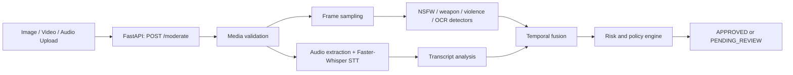

# AI Content Moderation Pipeline

A FastAPI service for multi-modal content moderation. It combines media validation, OCR, speech-to-text, visual detectors, temporal evidence fusion, optional semantic context, and policy-based decisions.

## Architecture



## Setup

```bash
python -m venv .venv
# Activate the environment for your platform
python -m pip install -r requirements.txt
cp .env.example .env
python -m uvicorn app:app --host 127.0.0.1 --port 8000
```

Install FFmpeg for video audio extraction and Tesseract for OCR. Set `TESSERACT_CMD` when it is not already on `PATH`.

The configured Faster-Whisper model and detector weights may download on first use. Keep `models/` out of version control; it is intentionally listed in `.gitignore`.

## API

```bash
curl -X POST http://127.0.0.1:8000/moderate -F "file=@example.mp4"
```

The response provides a safe backend decision. Treat `PENDING_REVIEW` as a fail-closed result and send it through an authenticated human-review workflow.

## Notes

- Store provider keys only in server-side secret management.
- `BACKEND_LONG_VIDEO_SECONDS=20` routes longer videos into the review path.
- Replace the included process-local review queue with persistent storage before multi-instance production deployment.
