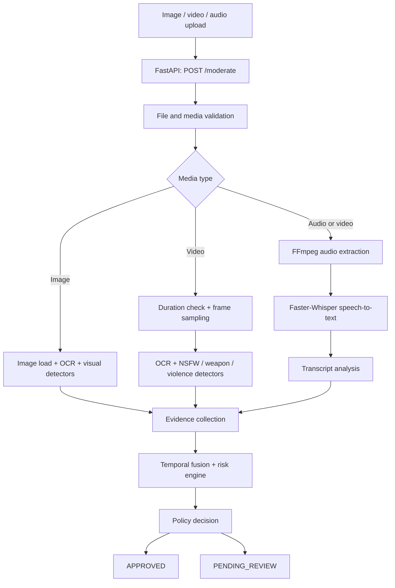

# AI Content Moderation Pipeline

A reusable FastAPI service for fail-closed moderation of images, video, audio, and text-bearing media. The service combines file validation, frame sampling, OCR, speech-to-text, visual safety detectors, temporal evidence fusion, optional AI reasoning, and a policy-based final decision.

It is designed as a backend service: client applications upload media to `POST /moderate`, then use the returned decision in their own publishing or review workflow.

## Key capabilities

- **Image moderation:** visual safety checks and OCR-based text extraction.
- **Video moderation:** duration validation, frame sampling, temporal fusion, and audio processing.
- **Audio moderation:** audio extraction and Faster-Whisper speech-to-text.
- **OCR:** Tesseract is used to detect text embedded in images and video frames.
- **Visual detectors:** NSFW, weapon, violence, and related configurable detector paths.
- **Transcript analysis:** moderation analysis can consider speech transcription alongside visual evidence.
- **Provider abstraction:** optional Gemini, OpenRouter, and Groq adapters are isolated behind the service layer.
- **Fail-closed behavior:** uncertain, unsafe, unavailable, malformed, or over-limit media can be sent to human review rather than automatically approved.

## Architecture



## Decision model

The API returns a stable backend decision. Treat results as follows:

| Result | Recommended application action |
| --- | --- |
| `APPROVED` | Continue the normal publication workflow. |
| `PENDING_REVIEW` | Do not publish automatically; create a human-review item. |
| Validation/processing error | Fail safely and present a neutral retry or review message to the end user. |

The exact response may include structured moderation metadata for trusted server-side consumers. Do not display internal detector details, confidence values, prompts, or provider errors in a customer UI.

## Repository layout

```text
.
├── app.py                         # FastAPI /moderate endpoint
├── content_moderation/
│   ├── workflow.py                # Stable application-facing moderation contract
│   ├── pipeline.py                # Multi-stage media moderation pipeline
│   └── ai/                        # Provider interfaces and adapters
│       ├── service.py
│       ├── provider.py
│       └── providers/             # Gemini, OpenRouter, and Groq adapters
├── tests/test_api.py              # Isolated endpoint test
├── .env.example                   # Safe configuration template
├── requirements.txt               # Python dependencies
└── .gitignore                     # Excludes secrets, model caches, and generated data
```

## Prerequisites

- Python 3.9 or later
- FFmpeg installed and available on `PATH` for video audio extraction
- Tesseract OCR installed and available on `PATH`, or configured through `TESSERACT_CMD`
- Disk space and internet access for first-use model downloads
- Optional server-side provider keys for Gemini, OpenRouter, or Groq

### System tools

Install FFmpeg and Tesseract before running the service:

```bash
# Ubuntu / Debian example
sudo apt-get update
sudo apt-get install -y ffmpeg tesseract-ocr
```

On Windows, install each tool and either add it to `PATH` or set `TESSERACT_CMD` to the Tesseract executable path in `.env`.

## Installation

```bash
git clone https://github.com/ahmadijaz1303/AI-Content-Moderation-Pipeline.git
cd AI-Content-Moderation-Pipeline
python -m venv .venv
```

Activate the environment:

```bash
# Windows PowerShell
.venv\Scripts\Activate.ps1

# macOS / Linux
source .venv/bin/activate
```

Install dependencies and create local configuration:

```bash
python -m pip install -r requirements.txt
copy .env.example .env          # Windows
# cp .env.example .env          # macOS / Linux
```

Start the API:

```bash
python -m uvicorn app:app --host 127.0.0.1 --port 8000
```

Interactive API documentation is available at `http://127.0.0.1:8000/docs`.

## Configuration

Use `.env.example` as a template. Never commit a real `.env` file or provider key.

| Variable | Purpose |
| --- | --- |
| `GEMINI_API_KEY` | Optional Gemini server-side API key. |
| `OPENROUTER_API_KEY` | Optional OpenRouter server-side API key. |
| `GEMINI_VISION_MODEL` | Gemini vision model identifier. |
| `OPENROUTER_VISION_MODEL` | OpenRouter vision model identifier. |
| `GEMINI_TIMEOUT_SECONDS` | Bound provider wait time; prevents indefinite request hangs. |
| `MODERATION_MODEL_DIRECTORY` | Directory where detector model files are stored or downloaded. |
| `TESSERACT_CMD` | Full path to Tesseract when it is not on `PATH`. |
| `STT_MODEL_SIZE` | Faster-Whisper model size used for transcription. |
| `BACKEND_LONG_VIDEO_SECONDS` | Video duration threshold; defaults to `20` seconds. Longer videos enter review rather than normal automatic handling. |
| `API_MAX_UPLOAD_BYTES` | Maximum accepted upload size in bytes. |
| `API_UPLOAD_CHUNK_BYTES` | Streaming upload chunk size. |

## Model assets and first run

The repository intentionally does **not** include large model binaries. The configured Faster-Whisper STT model and detector weights may be retrieved or initialized on first use. Keep the model cache on persistent storage in deployment environments to avoid repeat downloads.

`models/`, generated frames, benchmark data, logs, caches, and virtual environments are excluded from version control by `.gitignore`.

## API usage

### Moderate an image or video

`POST /moderate` accepts multipart form uploads using the `file` field.

```bash
curl -X POST http://127.0.0.1:8000/moderate \
  -F "file=@example.mp4"
```

Use the endpoint only from a trusted backend or an authenticated gateway. Do not expose provider credentials or raw internal decisions to web/mobile clients.

## Integration guidance

1. Store media temporarily in a protected server-side location.
2. Send the upload to this service using the authenticated backend, not directly from the client when that would expose internal infrastructure.
3. When the response is `APPROVED`, continue the normal publishing workflow.
4. When the response is `PENDING_REVIEW`, save the media reference and create a human-review task.
5. Retain only the metadata and media required by your privacy policy; clean up temporary upload files after processing.

For high-volume systems, run workers behind a queue, persist review records, add retry policies, and scale detector workers independently from the public API.

## Testing

Run the included offline test:

```bash
python -m pytest -q tests
```

This test validates endpoint delegation without sending real provider requests or requiring API keys.

## Security and production checklist

- Put all provider keys in server-side secret management.
- Authenticate and authorize callers of the moderation endpoint.
- Apply per-user and per-IP upload rate limits.
- Enforce MIME/type, size, and duration limits before expensive processing.
- Keep moderation logs and review evidence access-controlled.
- Monitor provider availability, queue depth, detector failures, and processing time.
- Use a persistent review queue/database before deploying more than one process.
- Regularly review model licensing, performance, and false-positive/false-negative behavior for your use case.

## License

Choose and add a license appropriate for your intended use before distributing this code.
